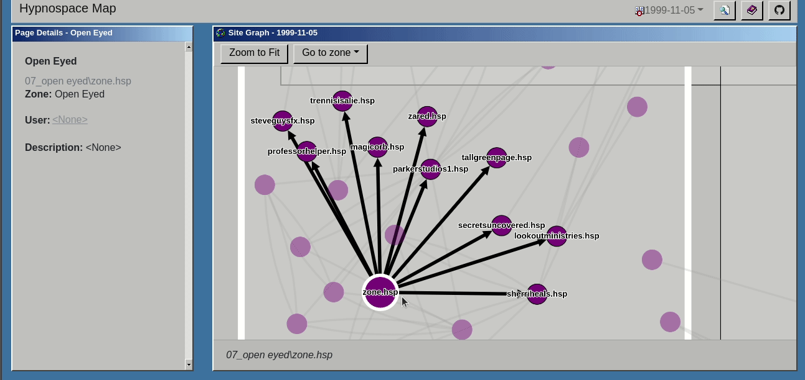

# Hypnospace Outlaw Sitemap


[](https://github.com/gbarkway/hypnospace-sitemap/actions/workflows/crawler-test.yml)


An interactive map of Hypnospace, the alternate-reality Internet from the wonderful 2019 game [Hypnospace Outlaw](http://www.hypnospace.net/). [Currently hosted here](https://hypnospacemap.ca)



## Run on your local machine

The below instructions require Docker and docker-compose

```
cd src
docker-compose --profile frontend up
```

The webapp is available at **http://localhost:5000**


Visit the subfolders listed below for more project-specific instructions

## Project structure

| Name  | Description   | Path | Localhost port |
| ------- |---------------|------| ----- |
| Capture service | Backend service for sitemap graph data (i.e. edges between pages) | src/capture-serv | 3001 |
| Page service | Backend service for viewing and searching detailed page information | src/page-serv | 3000 |
| Page service database | Mongodb for Page Service | src/page-serv-db |
| Webapp | Web frontend | src/web | 5000
| Crawler | Python scripts that parse Hypnospace Outlaw game data for use of above services | src/crawler |

## Dev Configuration

You can run with a more dev-friendly configuration by using the docker-compose.dev.yml file.

```
cd src
source aliases.sh
docker-compose-dev up --build
```

This is equivalent to
```
cd src
docker-compose -f docker-compose.yml -f docker-compose.dev.yml up --build
```

Note: webapp is part of the frontend profile, so it won't run by default.

The .dev.yml file makes these changes to the base:

- Maps page-serv and capture-serv app folders to src/page-serv and src/capture-serv and enables hot reloading
- Exposes ports for Node.js debugging:
    - page-serv: 9230
    - capture-serv: 9229
- Exposes page-serv-db on localhost:27017
